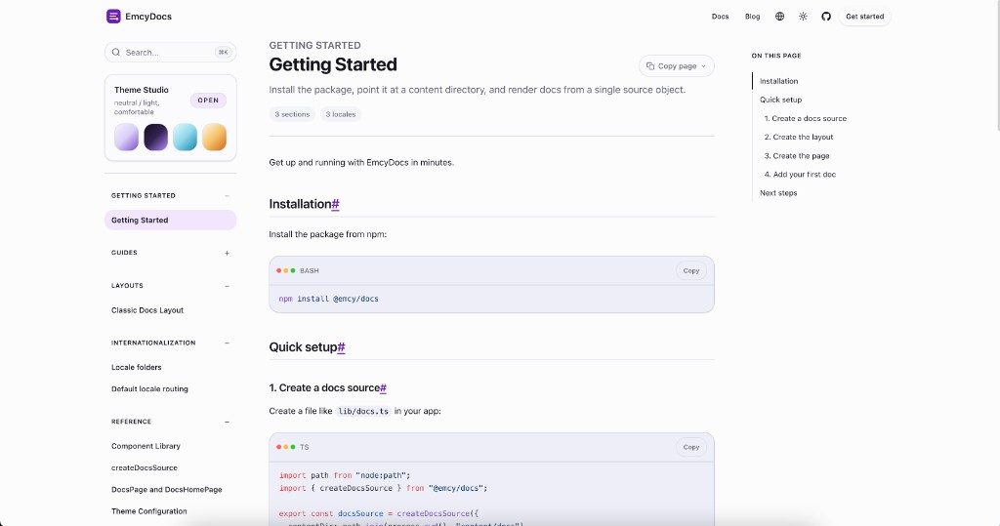
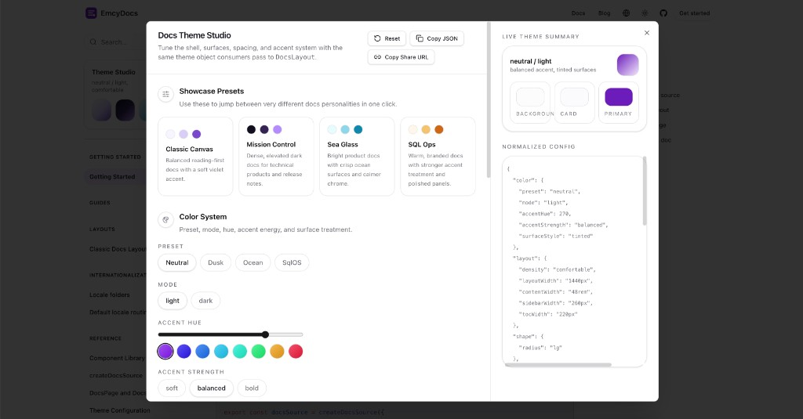

# EmcyDocs

`@emcy/docs` is an App Router-native MDX docs library for Next.js.

It is built for teams that want documentation content in the repo while still getting SEO-friendly prerendered routes, locale-aware file conventions, search, heading extraction, mobile-friendly docs UX, and a configurable docs shell that can either stay simple or plug into a richer app chrome.

This repository contains both the published package and the example site that dogfoods it:

- `src` contains the library source
- `tests` contains Vitest coverage
- `site` is the example Next.js app and the package's own docs/showcase

## Preview

<p align="center">
  
  
</p>

The example site ships with a polished docs shell and an optional live theme studio for tuning presets, density, surface styles, and accent behavior.

## Why use it

- Keep docs as repo-local MDX instead of a separate CMS
- Build navigation, route resolution, metadata, headings, and search from one `createDocsSource(...)` call
- Render docs with App Router-friendly primitives like `DocsLayout`, `DocsPage`, and `DocsHomePage`
- Ship a polished baseline with `DocsSearch`, `DocsSidebar`, `DocsToc`, `HeadingLinks`, and `MobileDocsChrome`
- Support locale-specific files like `getting-started/en.mdx`, `getting-started/es.mdx`, and `getting-started/zh.mdx`
- Restyle the shell with a nested theme object or a live theme provider
- Use bundled MDX building blocks such as banners, callouts, cards, tabs, steps, files, accordions, and code blocks

## Requirements

- Node.js `>=20`
- Next.js `>=15.5.0 <17`
- React `^19`
- React DOM `^19`

## Install

```bash
npm install @emcy/docs
```

Then import the shared stylesheet once in your docs layout:

```tsx
import "@emcy/docs/styles.css";
```

## Quick start

### 1. Create a docs source

Create `lib/docs.ts`:

```ts
import path from "node:path";
import { createDocsSource } from "@emcy/docs";

export const docsSource = createDocsSource({
  contentDir: path.join(process.cwd(), "content/docs"),
  basePath: "/docs",
  defaultLocale: "en",
  locales: ["en", "es", "zh"],
  hideDefaultLocaleInUrl: true,
  sectionOrder: ["", "guides", "reference"],
});
```

`docsSource` becomes the single source of truth for route resolution, navigation, metadata, headings, and search.

### 2. Create the docs layout

Create `app/docs/layout.tsx`:

```tsx
import { DocsLayout } from "@emcy/docs";
import "@emcy/docs/styles.css";
import { docsSource } from "@/lib/docs";

export default function Layout({
  children,
}: {
  children: React.ReactNode;
}) {
  return (
    <DocsLayout navigation={docsSource.getNavigation()}>
      {children}
    </DocsLayout>
  );
}
```

### 3. Create the docs route

Create `app/docs/[[...slug]]/page.tsx`:

```tsx
import { notFound, redirect } from "next/navigation";
import { DocsHomePage, DocsPage } from "@emcy/docs";
import { docsSource } from "@/lib/docs";

interface PageProps {
  params: Promise<{ slug?: string[] }>;
}

export function generateStaticParams() {
  return docsSource.getStaticParams();
}

export async function generateMetadata({ params }: PageProps) {
  const { slug } = await params;
  return docsSource.getMetadata(slug);
}

export default async function DocsRoutePage({ params }: PageProps) {
  const { slug } = await params;
  const resolved = docsSource.resolveRoute(slug);

  if (resolved.type === "redirect" && resolved.href) {
    redirect(resolved.href);
  }

  if (resolved.type !== "entry" || !resolved.entry) {
    notFound();
  }

  if (resolved.entry.isHome) {
    return (
      <DocsHomePage
        entry={resolved.entry}
        navigation={docsSource.getNavigation()}
      />
    );
  }

  return (
    <DocsPage
      entry={resolved.entry}
      previousEntry={resolved.previousEntry}
      nextEntry={resolved.nextEntry}
      backHref={docsSource.getHref()}
    />
  );
}
```

### 4. Add your first doc

Create `content/docs/getting-started/en.mdx`:

```mdx
---
title: "Getting Started"
description: "Your first EmcyDocs page"
order: 0
---

Welcome to your docs.
```

At that point, your app can render a static docs section from repo-local MDX under `/docs`.

## Theme system

`DocsLayout` accepts a nested `theme` object for static theming, and it can also read live theme state from `DocsThemeProvider` when you want a runtime switcher, persisted preferences, or a theme studio.

```tsx
import {
  DocsLayout,
  DocsThemeProvider,
  type DocsThemeConfig,
} from "@emcy/docs";
import { docsSource } from "@/lib/docs";

const docsTheme: DocsThemeConfig = {
  color: {
    preset: "ocean",
    mode: "dark",
    accentHue: 188,
    accentStrength: "bold",
    surfaceStyle: "elevated",
  },
  layout: {
    density: "compact",
    layoutWidth: "1480px",
    contentWidth: "50rem",
    sidebarWidth: "272px",
    tocWidth: "232px",
  },
  shape: {
    radius: "xl",
  },
};

export default function Layout({
  children,
}: {
  children: React.ReactNode;
}) {
  return (
    <DocsThemeProvider initialTheme={docsTheme}>
      <DocsLayout navigation={docsSource.getNavigation()}>
        {children}
      </DocsLayout>
    </DocsThemeProvider>
  );
}
```

If you do not need live editing, pass the same object directly to `DocsLayout` via `theme={docsTheme}` and skip the provider entirely.

## What ships today

- Source builders: `createDocsSource`, `extractHeadings`
- Docs shell primitives: `DocsLayout`, `DocsPage`, `DocsHomePage`, `DocsSearch`, `DocsSidebar`, `DocsToc`, `HeadingLinks`, `MobileDocsChrome`
- Theme primitives: `DocsThemeProvider`, `useDocsTheme()`, `resolveDocsTheme(theme)`
- MDX helpers and components: `DocsMdx`, `getDefaultMdxComponents()`, plus banners, callouts, cards, tabs, steps, file trees, accordions, and code blocks
- Optional blog primitives: `createBlogSource`, `BlogDirectoryPage`, `BlogPostPage`, `BlogSearch`, and related components
- Shared stylesheet: `@emcy/docs/styles.css`

## Local development

```bash
npm install
npm run dev
```

This starts:

- the library TypeScript build in watch mode
- the example site in `site` at `http://localhost:4003`

The example site is both a development sandbox and the canonical reference for how the package is wired into a real Next.js app.

## Useful scripts

```bash
npm run build:lib
npm run build:site
npm run lint
npm run test
npm run typecheck
```

## Dogfooding in SqlOS

From `sqlos/web`, use a local file dependency:

```json
{
  "dependencies": {
    "@emcy/docs": "file:../../emcydocs"
  }
}
```

The SqlOS repo also includes helper scripts to switch between a local file dependency and a published npm version.

## Release flow

- Merge to `main` with passing CI
- Tag a release like `v0.1.0`
- Push the tag
- GitHub Actions rebuilds, retests, and publishes `@emcy/docs` to npm
